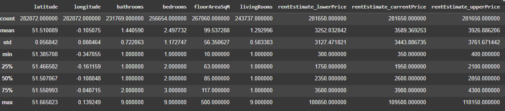
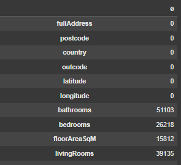
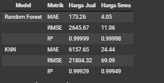

# Laporan Proyek Machine Learning - Rusdiana

## Domain Proyek

Perumahan merupakan salah satu kebutuhan dasar manusia yang penting [[1]](http://digilib.unila.ac.id/83/). Sebagaimana disebutkan dalam Pasal 28H ayat (1) Undang-Undang Dasar 1945 yang berbunyi: *"Setiap orang berhak hidup sejahtera lahir dan batin, bertempat tinggal, dan mendapatkan lingkungan hidup yang baik dan sehat serta berhak memperoleh pelayanan kesehatan"*. Meskipun terdapat pasal yang menjamin hak setiap orang untuk bertempat tinggal, apakah hal tersebut menjamin masyarakat dapat memperoleh atau membeli rumah/properti dengan harga yang sesuai?. Tentu saja, informasi yang akurat mengenai harga properti dan harga sewa sangat penting bagi pembeli, penjual, dan penyewa untuk membuat keputusan yang tepat. Oleh karena itu, *Machine Learning* dapat digunakan untuk memprediksi harga properti dan harga sewa dengan memanfaatkan data historis [[2]](https://books.google.co.id/books?hl=id&lr=&id=X5ySEAAAQBAJ&oi=fnd&pg=PT10&dq=G%C3%A9ron,+A.+(2019).+Hands-On+Machine+Learning+with+Scikit-Learn,+Keras,+and+TensorFlow:+Concepts,+Tools,+and+Techniques+to+Build+Intelligent+Systems.+O%27Reilly+Media.&ots=yC0rvk26AK&sig=n57OXRF4yCbLDaK2Crp1bhDg0CE&redir_esc=y#v=onepage&q=G%C3%A9ron%2C%20A.%20(2019).%20Hands-On%20Machine%20Learning%20with%20Scikit-Learn%2C%20Keras%2C%20and%20TensorFlow%3A%20Concepts%2C%20Tools%2C%20and%20Techniques%20to%20Build%20Intelligent%20Systems.%20O'Reilly%20Media.&f=false).

Memprediksi harga properti dan harga sewa secara akurat merupakan tantangan karena banyak faktor yang mempengaruhinya, seperti lokasi, ukuran, kondisi properti, dan tren pasar. Untuk mengatasi tantangan ini, kita dapat memanfaatkan machine learning, khususnya algoritma Random Forest dan KNN, untuk membangun model prediktif yang mampu mempelajari pola dari data historis dan memperkirakan harga properti serta harga sewa dengan akurasi yang tinggi. Model prediktif ini akan sangat bermanfaat bagi calon pembeli, penjual, dan penyewa dalam membuat keputusan yang lebih terinformasi, seperti dalam menentukan harga penawaran yang wajar, negosiasi harga, dan memilih properti yang sesuai dengan budget.

## Business Understanding

### Problem Statements

- Harga properti di London terus meningkat dan menjadikannya sulit dijangkau oleh banyak orang.
- Calon pembeli, penjual, dan penyewa properti membutuhkan informasi yang akurat tentang harga properti dan harga sewa untuk membuat keputusan yang tepat.
- Faktor-faktor yang memengaruhi harga properti dan harga sewa sangat kompleks dan sulit untuk dianalisis secara manual.

### Goals

- Mengembangkan model prediktif yang akurat untuk memperkirakan harga properti dan harga sewa di London.
- Membantu calon pembeli, penjual, dan penyewa properti dalam membuat keputusan yang lebih terinformasi terkait transaksi properti.
- Memberikan wawasan tentang faktor-faktor yang paling berpengaruh terhadap harga properti dan harga sewa di London.

    ### Solution statements
Tujuan dari proyek ini adalah untuk mengembangkan model prediktif yang akurat untuk memperkirakan harga properti dan harga sewa di London. Model ini diharapkan dapat membantu calon pembeli, penjual, dan penyewa properti dalam membuat keputusan yang lebih terinformasi terkait transaksi properti. Selain itu, proyek ini juga bertujuan untuk memberikan wawasan tentang faktor-faktor yang paling berpengaruh terhadap harga properti dan harga sewa di London

Untuk mencapai goals di atas, solusi yang diusulkan adalah sebagai berikut:

**Goal 1: Mengembangkan Model Prediktif yang Akurat**

- Bagian Model Memprediksi Nilai Property dan Harga Sewa: Kode ini melatih model Random Forest Regressor untuk prediksi harga jual dan sewa.
- Bagian Evaluasi dengan Metrix: Kode ini mengukur performa model menggunakan MAE, RMSE, dan R².
- Bagian Model & Evaluasi KNN: Kode ini melatih dan mengevaluasi model KNN sebagai pembanding.
- Bagian Perbandingan Model: Kode ini memvisualisasikan perbandingan performa model Random Forest dan KNN.

**Bagaimana Kode Berkontribusi**:

- Kode tersebut menunjukkan proses pengembangan, pelatihan, dan evaluasi model machine learning.
- Hasil evaluasi menunjukkan bahwa model Random Forest mencapai akurasi yang sangat tinggi (R² mendekati 1) untuk prediksi harga jual dan sewa.
- Perbandingan model menunjukkan Random Forest unggul dibandingkan KNN, mendukung pemilihan Random Forest sebagai model terbaik.

**Goal 2: Membantu Pengambilan Keputusan**

- Bagian Data Loading: Kode ini memuat dataset properti di London.
- Bagian Exploratory Data Analysis: Kode ini menganalisis dan memvisualisasikan data, memberikan pemahaman tentang karakteristik properti.
- Bagian Selection Features: Kode ini mengidentifikasi fitur-fitur penting yang digunakan dalam model.

**Bagaimana Kode Berkontribusi**:

- Kode menyediakan data dan informasi yang dibutuhkan untuk memahami pasar properti di London.
- Model yang dikembangkan dapat digunakan untuk mendapatkan estimasi harga jual dan sewa.
- Analisis data dan fitur memberikan konteks dan pemahaman yang lebih dalam bagi pengambil keputusan.

**Goal 3: Memberikan Wawasan**

- Bagian Exploratory Data Analysis: Kode ini memvisualisasikan distribusi data dan hubungan antar fitur.
- Bagian Multivariate Analysis: Kode ini menghitung dan memvisualisasikan korelasi antar fitur.
- Bagian Selection Features: Kode ini mengidentifikasi fitur-fitur yang paling relevan untuk prediksi.

**Bagaimana Kode Berkontribusi**:

- Visualisasi dan analisis data mengungkap pola dan tren dalam harga properti dan sewa.
- Analisis korelasi mengidentifikasi fitur-fitur yang memiliki hubungan kuat dengan harga, seperti lokasi, luas area, dan jumlah kamar.
- Fitur-fitur yang dipilih oleh RFE menunjukkan faktor-faktor yang paling berpengaruh dalam prediksi harga.

## Data Understanding
Dataset yang digunakan dalam proyek ini memiliki 282.872 enti data. yang mana terdiri dari 28 kolom berisi informasi mengenai properti di London, seperti:
   - **Lokasi**: `fullAddress, postcode, country, outcode, latitude, longitude`
   - **Karakteristik Properti**: `bathrooms, bedrooms, floorAreaSqM, livingRooms, tenure, propertyType, currentEnergyRating`
   - **Estimasi Harga**: `rentEstimate_lowerPrice, rentEstimate_currentPrice, rentEstimate_upperPrice, saleEstimate_lowerPrice, saleEstimate_currentPrice, saleEstimate_upperPrice, saleEstimate_confidenceLevel`
   - **Riwayat Harga**: `history_date, history_price, history_percentageChange, history_numericChange` 

Data yang saya gunakan bersumber dari platform kaggle dengan judul [London House Price Data](https://www.kaggle.com/datasets/jakewright/house-price-data/data) yang diperoleh dari akun **Jake Wright**.

### Variabel-variabel pada London House Price Data dataset adalah sebagai berikut:
**Deskripsi Variable**

| NO | Variable | Deskripsi |
|----|----------|-----------|
| 1 | fullAddres | Alamat lengkap properti |
| 2 | postcode | Kode pos mengidentifikasi area tertentu di London |
| 3 | country | Negara |
| 4 | outcode | Bagian pertama dari kode pos, mengelompokkan properti ke dalam zona geografis yang lebih luas |
| 5 | latitude | Koordinat geografis untuk pemetaan atau analisis berbasis lokasi|
| 6 |  longitude | Koordinat geografis untuk pemetaan atau analisis berbasis lokasi|
| 7 | bathrooms | Jumlah kamar mandi |
| 8 | bedrooms | Jumlah tempat tidur |
| 9 | floorAreaSqM | Luas lantai dalam meterpersegi |
| 10 | livingRooms | Ruang tamu |
| 11 | tenure | Status properti |
| 12 | propertyType | Jenis properti |
| 13 | currentEnergyRating | Peringkat energi saat ini |
| 14 | rentEstimate_lowerPrice | Estimasi harga sewa terendah |
| 15 | rentEstimate_currentPrice | Estimasi harga sewa saat ini |
| 16 | rentEstimate_upperPrice | Estimasi harga sewa tertinggi |
| 17 | saleEstimate_lowerPrice | Estimasi harga jual terendah |
| 18 | saleEstimate_currentPrice | Estimasi harga jual saat ini |
| 19 | saleEstimate_upperPrice | Estimasi harga jual tertinggi |
| 20 | saleEstimate_confidenceLevel | Keyakinan terhadap harga jual (LOW, MEDIUM, HIGH) |
| 21 | saleEstimate_ingestedAt | Estimasi stempel waktu penjulan |
| 22 | saleEstimate_valueChange.numericChange | Perubahan nilai absolut dalam estimasi harga jual properti |
| 23 | saleEstimate_valueChange.percentageChange | Persentase perubahan nilai absolut dalam estimasi harga jual properti |
| 24 | saleEstimate_valueChange.saleDate | Estimasi perubahan tanggal nilai jual |
| 25 | history_date | Histori tanggal |
| 26 | history_price | Histori harga |
| 27 | history_percentageChange | Histori persentase perubahan harga jual |
| 28 | history_numericChange | Histori perubahan angka |

### Analysis Deskriptif


(Gambar 1)

Tabel tersebut menyajikan statistik deskriptif umum untuk masing-masing variabel, antara lain:
- count: Menunjukkan jumlah observasi valid untuk setiap variabel. Terlihat bahwa variabel bathrooms, bedrooms, dan livingRooms memiliki beberapa missing values karena jumlah observasinya kurang dari 282.872.

- mean: Menunjukkan nilai rata-rata. Rata-rata properti memiliki 1.44 kamar mandi, 2.5 kamar tidur, luas lantai 99.54 meter persegi, dan 1.29 ruang tamu.
Estimasi harga sewa rata-rata berada di kisaran £3.252 - £3.927 per bulan.
std: Menunjukkan standar deviasi, yang mengukur sebaran data. Standar deviasi yang tinggi menunjukkan variasi data yang besar.

- min: Menunjukkan nilai minimum. Properti terkecil memiliki 1 kamar mandi, 1 kamar tidur, dan luas lantai 10 meter persegi.
25%, 50%, 75%: Menunjukkan kuantil data. 50% data (median) properti memiliki 1 kamar mandi, 2 kamar tidur, dan luas 85 meter persegi.

- max: Menunjukkan nilai maksimum. Properti terbesar dalam dataset memiliki 9 kamar mandi dan 9 kamar tidur, dengan luas lantai mencapai 50.000 meter persegi.

Poin Penting:

Terdapat variasi yang cukup besar dalam ukuran properti, mulai dari yang sangat kecil hingga yang sangat besar.
Estimasi harga sewa juga menunjukkan rentang yang luas.
Adanya missing values pada beberapa variabel perlu ditangani sebelum dilakukan analisis lebih lanjut.

### Missing Value



(Gambar 2)

Pada cuplikan gambar diatas menunjukkan informasi mengenai jumlah data valid yang ada pada setiap kolom dalam suatu dataset properti. Seperti kolom fullAddress, postcode, country,  outcode, latitude, dan longitude tidak memiliki data valid sama sekali. Sementara itu, kolom bathrooms memiliki 51.103 data, bedrooms 26.218 data, floorAreaSqM 15.812 data, dan livingRooms 39.135 data.  Data ini mengindikasikan adanya missing values yang signifikan pada dataset, terutama pada kolom-kolom yang berhubungan dengan alamat dan lokasi properti.  Sebelum dilakukan analisis lebih lanjut,  perlu dilakukan penanganan terhadap missing values tersebut.
Untuk mengatasinya saya e

### Melihat Persebaran Data dan Outlier dengan Boxplot


(Gambar 3)

Pada tahapan ini saya melakukan visualisasi untuk mengetahui persebaran data dan sekaligus melihat outlier yang ada pada data.
Berikut ini adalah interpretasi ringkasannya:

1. Latitude and Longitude : Variabel-variabel ini memiliki rentang yang cukup sempit tanpa outlier yang signifikan, yang diharapkan karena mereka mewakili koordinat geografis di London.

2. Bathrooms, Bedrooms, Living Rooms: Fitur-fitur ini memiliki nilai-nilai diskrit (bilangan bulat), dan outlier-nya minimal. Namun, ada beberapa properti dengan jumlah atribut ini yang lebih tinggi.

3. Floor Area (floorAreaSqM): Terdapat berbagai macam luas lantai, dengan beberapa nilai outlier pada batas atas, yang menunjukkan properti dengan luas lantai lebih besar dari rata-rata.

4. Rent and Sale Estimates (lowerPrice, currentPrice, upperPrice):

- Fitur-fitur ini memiliki konsentrasi nilai yang tinggi mendekati batas bawah skala, dengan sejumlah besar outlier yang mewakili properti bernilai tinggi.
- Pola ini menunjukkan bahwa sementara sebagian besar properti berada dalam kisaran harga bawah hingga menengah, beberapa di antaranya dihargai jauh lebih tinggi, mungkin karena faktor unik (seperti properti mewah).

5. Sale and History Changes (numericChange, percentageChange):

- Fitur-fitur ini menunjukkan beberapa nilai ekstrem, yang mengindikasikan perubahan harga yang substansial untuk beberapa properti.
- Penyimpangan ini mungkin terjadi akibat pergeseran pasar terkini, renovasi, atau apresiasi/depresiasi dari waktu ke waktu.

Secara keseluruhan, sebagian besar fitur keuangan memiliki banyak outlier di sisi yang lebih tinggi, yang mungkin perlu ditangani (misalnya, dengan transformasi atau penskalaan) untuk meningkatkan kinerja model. Tapi Untuk proses analisis ini, outlier tidak akan dibuang karena sangat memungkinkan nilai tersebut termasuk dalam outlier. Data sudah siap untuk diproses dan dianalisis.

Selanjutnya saya melakukan teknik **Univariate Analysis** pada fitur kategorik dengan hasil visualisasi sebagai berikut.


(Gambar 4)

Pada visualisasi tersebut kita dapat menginterpretasikannya sebagai berikut.

- **postcode**:
Menunjukkan 10 kode pos dengan frekuensi tertinggi dalam dataset.
WC2R 1AB adalah kode pos yang paling sering muncul.
Sebagian besar properti terkonsentrasi di area dengan kode pos tersebut.
- **country**:
Hanya menampilkan "England", menunjukkan dataset hanya berisi properti di Inggris.
- **outcode**:
Menampilkan 10 outcode dengan frekuensi tertinggi.
SE18 adalah outcode yang paling umum.
Distribusi outcode lebih merata dibanding postcode, menunjukkan cakupan data yang lebih luas di London.
- **tenure**:
Mayoritas properti berstatus leasehold (sewa).
Freehold (milik penuh) jauh lebih sedikit, diikuti shared dan feudal yang sangat jarang.

- **propertyType**:
"Flat/Maisonette" dan "Purpose Built Flat" adalah tipe properti yang paling dominan, menunjukkan dataset banyak berisi apartemen.
Tipe lain seperti "Mid Terrace", "Detached", dan "Semi-Detached" jauh lebih sedikit.
- **currentEnergyRating**:
Sebagian besar properti memiliki energy rating "E", diikuti "D" dan "C".
Rating "A" hingga "C" yang lebih efisien relatif jarang.

- **saleEstimate_confidenceLevel**:
Tingkat kepercayaan estimasi harga jual didominasi oleh "MEDIUM".
"HIGH" dan "LOW" lebih sedikit, mengindikasikan kebanyakan estimasi memiliki tingkat kepercayaan menengah.
- **saleEstimate_ingestedAt**:
Menampilkan satu nilai unik, kemungkinan timestamp saat data estimasi harga dimasukkan ke sistem.
Tidak memberikan informasi distribusi.

- **saleEstimate_valueChange.saleDate**:
Menampilkan 10 tanggal perubahan nilai estimasi harga jual terbanyak.
Distribusi tidak merata, ada beberapa tanggal dengan frekuensi tinggi.
- **history_date**:
Menampilkan 10 tanggal riwayat properti terbanyak.
Distribusi lebih merata dibanding saleEstimate_valueChange.saleDate.

Tahapan selanjutnya saya mencoba melakukan teknik **Multivariate Analysis** dengan menggunakan uji korelasi heatmap untuk semua type data.


(Gambar 5)

Pada visualisasi tersebut dapat disimpulkan sebagai berikut:
- Korelasi Positif yang Kuat: Variabel-variabel seperti saleEstimate_lowerPrice (0.98) dan saleEstimate_upperPrice (0.98) memiliki korelasi sangat tinggi dengan saleEstimate_currentPrice. Ini menunjukkan bahwa harga estimasi penjualan pada kisaran yang lebih rendah atau lebih tinggi sangat erat kaitannya dengan harga estimasi penjualan saat ini.

- Korelasi Positif Sedang: bedrooms (0.52), floorAreaSqM (0.49), dan livingRooms (0.49) juga memiliki korelasi positif sedang terhadap saleEstimate_currentPrice, yang berarti jumlah kamar tidur, luas area lantai, dan jumlah ruang tamu cenderung berhubungan dengan estimasi harga penjualan.

- Korelasi Rendah hingga Negatif: Variabel seperti latitude dan longitude memiliki korelasi yang rendah atau hampir tidak signifikan dengan saleEstimate_currentPrice.

- Korelasi Positif yang Kuat: Variabel seperti rentEstimate_lowerPrice (0.73) dan rentEstimate_upperPrice (0.73) memiliki korelasi yang cukup kuat dengan rentEstimate_currentPrice. Ini menunjukkan bahwa estimasi harga sewa untuk kisaran lebih rendah dan lebih tinggi memiliki keterkaitan erat dengan harga sewa saat ini.

- Korelasi Positif Sedang hingga Lemah: bedrooms (0.63), floorAreaSqM (0.47), dan livingRooms (0.62) juga memiliki korelasi sedang dengan rentEstimate_currentPrice, yang menunjukkan bahwa karakteristik properti seperti jumlah kamar tidur dan ruang tamu juga berperan dalam estimasi harga sewa.

- Korelasi Rendah hingga Negatif: latitude dan longitude memiliki korelasi yang sangat rendah dengan rentEstimate_currentPrice, yang menunjukkan bahwa lokasi secara spesifik mungkin tidak terlalu signifikan dalam mempengaruhi estimasi harga sewa dibandingkan karakteristik fisik properti.

## Data Preparation

Sebelum membangun model machine learning, penting untuk mempersiapkan data terlebih dahulu. Tahapan ini bertujuan untuk memastikan data memiliki kualitas yang baik dan sesuai dengan kebutuhan model. Pada laporan ini, akan dijelaskan langkah-langkah data preparation yang telah dilakukan pada dataset harga rumah di London, serta alasan di balik setiap langkah tersebut.

1. Menangani Data Duplikat

   - Teknik: `dataframe.drop_duplicates(inplace=True)`
   - Proses: Kode ini digunakan untuk menghapus baris-baris data yang duplikat dalam dataframe.
   - Alasan: Data duplikat dapat menyebabkan bias dalam model dan mengurangi akurasi prediksi. Dengan menghapusnya, kita memastikan bahwa setiap data point unik dan berkontribusi secara independen terhadap model.

2. Feature Selection

   - Teknik: Correlation Analysis dan Recursive Feature Elimination (RFE)
    Proses:
   - Correlation Analysis: Menghitung korelasi antar fitur dan target untuk mengidentifikasi fitur yang memiliki hubungan kuat dengan target.
   - RFE: Memilih fitur secara rekursif dengan mengeliminasi fitur yang kurang penting.
   - Alasan:
      - Mengurangi kompleksitas model dan meningkatkan efisiensi komputasi.
      - Memilih fitur yang paling relevan dapat meningkatkan akurasi prediksi dan mencegah overfitting.

3. Handling Missing Value

   - Teknik: Imputasi dengan median (untuk fitur numerik)
   - Proses: Kode mengidentifikasi missing values (nilai kosong) pada fitur-fitur yang dipilih dan menggantinya dengan nilai median dari kolom tersebut.
   - Alasan: Missing values dapat menyebabkan masalah dalam pemodelan. Imputasi dengan median adalah salah satu cara untuk menangani missing values tanpa menghapus data point yang berharga.

4. Data Splitting:
    - Data dibagi menjadi data training dan data testing.
    - Alasan: Memisahkan data penting untuk mengevaluasi performa model pada data yang belum pernah dilihat sebelumnya.
    - Kode:
        ```
        X_train, X_test, y_train_sale, y_test_sale, y_train_rent, y_test_rent = train_test_split(
       dataframe_clean[selected_features_sale],  # Fitur yang sama untuk kedua model
       y_sale,                                   # Target harga jual
       y_rent,                                   # Target harga sewa
       test_size=0.2,
       random_state=42)
        ```

5. Data Scaling:
    - StandardScaler digunakan untuk melakukan scaling pada fitur numerik.
    - Alasan: Scaling data membantu agar fitur-fitur dengan skala yang berbeda tidak mendominasi proses training model dan meningkatkan performa model.
    - Kode:
        ```
        scaler = StandardScaler()

        numerical_features = ['saleEstimate_lowerPrice', 'saleEstimate_upperPrice', 'rentEstimate_lowerPrice', 'rentEstimate_upperPrice', 'floorAreaSqM']

        X_train[numerical_features] = scaler.fit_transform(X_train[numerical_features])
        X_test[numerical_features] = scaler.transform(X_test[numerical_features])
        ```

Teknik-teknik data preparation yang dilakukan bertujuan untuk membersihkan data, memilih fitur yang relevan, dan mengubah data ke dalam format yang sesuai untuk pemodelan. Tahapan ini sangat penting untuk meningkatkan akurasi dan kinerja model machine learning dalam memprediksi harga properti dan harga sewa.


## Modeling
Setelah data dipersiapkan dengan baik, tahap selanjutnya adalah membangun model machine learning untuk memprediksi harga properti dan harga sewa. Pada laporan ini, akan dibahas dua algoritma yang digunakan, yaitu Random Forest dan K-Nearest Neighbors (KNN), serta perbandingan performa keduanya untuk menentukan model terbaik.

**Model yang Digunakan**

1. Random Forest
    - Deskripsi: Random Forest adalah algoritma ensemble learning yang menggabungkan beberapa decision tree untuk membuat prediksi yang lebih akurat dan robust.
    
    - Kelebihan:
       - Mampu menangani data dengan banyak fitur dan mengurangi overfitting.
       - Dapat digunakan untuk klasifikasi dan regresi.
       - Relatif mudah diimplementasikan dan diinterpretasikan.
    
    - Kekurangan:
       - Membutuhkan waktu training yang lebih lama dibandingkan beberapa algoritma lain.
       - Dapat menjadi kompleks dan sulit diinterpretasikan jika jumlah tree terlalu banyak.
    
    - Parameter:
       - random_state=42: Digunakan untuk memastikan reproducibility hasil.
       - Parameter lain seperti jumlah estimator dan kedalaman tree dapat di-tuning lebih lanjut untuk meningkatkan performa.
    - Kode:
        ```
        model_sale = RandomForestRegressor(random_state=42)
        model_sale.fit(X_train, y_train_sale)
        ```

2. K-Nearest Neighbors (KNN)
    - Deskripsi: KNN adalah algoritma yang memprediksi berdasarkan kedekatan data baru dengan data training yang sudah ada.
    
    - Kelebihan:
       - Mudah diimplementasikan dan dipahami.
       - Tidak memerlukan asumsi tentang distribusi data.
    
    - Kekurangan:
       - Sensitif terhadap outlier dan data dengan skala yang berbeda.
       - Dapat menjadi lambat jika data training sangat besar.
    
    - Parameter:
       - n_neighbors=5: Menentukan jumlah tetangga terdekat yang digunakan untuk prediksi.
    
    - Kode:
        ```
        knn_model = KNeighborsRegressor(n_neighbors=5)
        knn_model.fit(X_train, y_train_sale)
        ```

**Pemilihan Model Terbaik**

Berdasarkan hasil evaluasi menggunakan metrik MAE, RMSE, dan R², model **Random Forest** terpilih sebagai model terbaik untuk prediksi harga properti dan harga sewa.

Alasan:

- Performa Lebih Baik: Random Forest menunjukkan nilai MAE dan RMSE yang jauh lebih rendah dibandingkan KNN, baik untuk prediksi harga jual maupun harga sewa. Ini menunjukkan bahwa prediksi dari Random Forest lebih akurat dan memiliki kesalahan yang lebih kecil.
- Robustness: Random Forest lebih robust terhadap outlier dan data dengan skala yang berbeda dibandingkan KNN, sehingga memberikan hasil yang lebih stabil.
- R² yang Tinggi: Meskipun kedua model memiliki nilai R² yang tinggi, Random Forest tetap memberikan hasil yang sedikit lebih baik, menunjukkan kemampuannya dalam menjelaskan variasi data.

Model Random Forest dipilih sebagai model terbaik untuk prediksi harga properti dan harga sewa karena performa yang lebih baik, robustness, dan kemampuannya dalam menjelaskan variasi data. Model ini dapat diimplementasikan untuk memberikan prediksi yang akurat dan handal.

## Evaluation

Setelah model machine learning dibangun dan dilatih, langkah selanjutnya adalah mengevaluasi performanya. Pada laporan ini, akan dijelaskan metrik evaluasi yang digunakan untuk mengukur kinerja model Random Forest dalam memprediksi harga properti dan harga sewa, serta interpretasi dari hasil evaluasi tersebut.

**Metrik Evaluasi**

Metrik yang digunakan untuk mengevaluasi model adalah:
1. Mean Absolute Error (MAE)

    - Penjelasan: MAE mengukur rata-rata kesalahan absolut antara nilai prediksi dan nilai aktual.

    - Formula: MAE = (1/n) * Σ|yi - ŷi|
        - yi: nilai aktual
        - ŷi: nilai prediksi
        - n: jumlah data
    
    - Cara Kerja: MAE menghitung selisih absolut antara nilai prediksi dan nilai aktual untuk setiap data, kemudian merata-ratakan selisih tersebut. Semakin rendah nilai MAE, semakin baik performa model.

2. Root Mean Squared Error (RMSE)

    - Penjelasan: RMSE mengukur akar kuadrat dari rata-rata kesalahan kuadrat antara nilai prediksi dan nilai aktual.
    - Formula: RMSE = √[(1/n) * Σ(yi - ŷi)²]
    - Cara Kerja: RMSE memberikan penalti yang lebih besar untuk kesalahan yang lebih besar. Semakin rendah nilai RMSE, semakin baik performa model.

3. R-squared (R²)

    - Penjelasan: R² mengukur seberapa baik model dapat menjelaskan variasi dalam data target.
    - Formula: R² = 1 - (SSR/SST)
        - SSR: sum of squares of residuals (jumlah kuadrat sisa)
        - SST: total sum of squares (jumlah kuadrat total)
    - Cara Kerja: R² menunjukkan proporsi variasi dalam data target yang dapat dijelaskan oleh model. Nilai R² berkisar antara 0 hingga 1, di mana nilai 1 menunjukkan model yang sempurna.

**Hasil Evaluasi**
Berikut adalah hasil evaluasi model:



(Gambar 6)

**Ulasan Hasil Evaluasi**:

1. Random Forest:

   - Menunjukkan kinerja yang sangat baik untuk prediksi harga jual dan harga sewa, dengan nilai MAE, RMSE, dan R² yang sangat baik.
   - MAE dan RMSE yang rendah menunjukkan bahwa prediksi model sangat akurat dan mendekati nilai sebenarnya.
   - R² yang mendekati 1 menunjukkan bahwa model dapat menjelaskan hampir semua varians dalam data.

2. KNN:

   - Menunjukkan kinerja yang baik dalam hal R², tetapi nilai MAE dan RMSE jauh lebih tinggi dibandingkan dengan Random Forest, terutama untuk prediksi harga jual.
   - MAE dan RMSE yang lebih tinggi menunjukkan bahwa prediksi KNN memiliki kesalahan yang lebih besar dibandingkan dengan Random Forest.


**Penentuan Model Terbaik:**


(Gambar 7)
Berdasarkan hasil evaluasi, model Random Forest secara keseluruhan lebih unggul dibandingkan dengan KNN untuk prediksi nilai properti dan harga sewa. Random Forest menghasilkan prediksi yang lebih akurat dan memiliki kesalahan yang lebih kecil.

Problem statement yang ingin dijawab adalah: **Bagaimana cara memprediksi nilai properti dan harga sewa di London dengan akurat**?

**Goals yang ingin dicapai adalah**:

- Mengembangkan model prediktif yang akurat untuk nilai properti dan harga sewa.
- Memberikan informasi yang berguna bagi stakeholder (misalnya, pembeli, penjual, penyewa, agen properti) dalam pengambilan keputusan terkait properti.

**Solusi Statement dan Dampaknya**:

Solusi statement yang diusulkan adalah: Menggunakan model machine learning, khususnya Random Forest dan KNN, untuk memprediksi nilai properti dan harga sewa berdasarkan fitur-fitur yang relevan.

**Dampak**:

1. Menjawab Problem Statement:

   - Model Random Forest, sebagai model terbaik, telah menunjukkan kemampuan yang sangat baik dalam memprediksi nilai properti dan harga sewa dengan akurasi tinggi.
   - Hal ini menjawab problem statement dengan menyediakan solusi prediktif yang handal.

2. Mencapai Goals:

   - Goal 1 tercapai. Model Random Forest telah berhasil dikembangkan dan menunjukkan akurasi yang tinggi dalam prediksi.
   - Goal 2 tercapai. Model ini memberikan informasi berharga bagi stakeholder, seperti estimasi harga jual dan sewa yang akurat, yang dapat membantu mereka dalam pengambilan keputusan, seperti:
       - **Pembeli**: Membantu menentukan harga penawaran yang wajar.
       - **Penjual**: Membantu menentukan harga jual yang optimal.
       - **Penyewa**: Membantu dalam mencari properti dengan harga sewa yang sesuai.
       - **Agen Properti**: Membantu dalam memberikan estimasi harga yang akurat kepada klien.

3. Dampak Solusi Statement:

   - Solusi statement yang diusulkan, yaitu penggunaan model machine learning, terbukti berdampak positif.
   - Model Random Forest memberikan prediksi yang akurat dan dapat diandalkan, sehingga berpotensi meningkatkan efisiensi dan transparansi di pasar properti.

**Kesimpulan**:

Model Random Forest tidak hanya memberikan solusi prediktif yang akurat, tetapi juga memberikan dampak positif terhadap business understanding dengan menjawab problem statement, mencapai goals, dan memberikan informasi berharga bagi stakeholder di pasar properti.

## Referensi
[1] Tanirun, Andri Wibowo (2011). *PERAN PEMERINTAH DAERAH DALAM PENYELESAIAN SENGKETA FASILITAS SOSIAL DAN FASILITAS UMUM PERUMAHAN*. Fakultas Hukum, Universitas Lampung. Tersedia: [digilib: Digital Reposisory UNILA](http://digilib.unila.ac.id/83/).

[2] Géron, A. (2019). Hands-On Machine Learning with Scikit-Learn, Keras, and TensorFlow: Concepts, Tools, and Techniques to Build Intelligent Systems. O'Reilly Media. Tersedia: [books.google.co.id](https://books.google.co.id/books?hl=id&lr=&id=X5ySEAAAQBAJ&oi=fnd&pg=PT10&dq=G%C3%A9ron,+A.+(2019).+Hands-On+Machine+Learning+with+Scikit-Learn,+Keras,+and+TensorFlow:+Concepts,+Tools,+and+Techniques+to+Build+Intelligent+Systems.+O%27Reilly+Media.&ots=yC0rvk26AK&sig=n57OXRF4yCbLDaK2Crp1bhDg0CE&redir_esc=y#v=onepage&q=G%C3%A9ron%2C%20A.%20(2019).%20Hands-On%20Machine%20Learning%20with%20Scikit-Learn%2C%20Keras%2C%20and%20TensorFlow%3A%20Concepts%2C%20Tools%2C%20and%20Techniques%20to%20Build%20Intelligent%20Systems.%20O'Reilly%20Media.&f=false)
